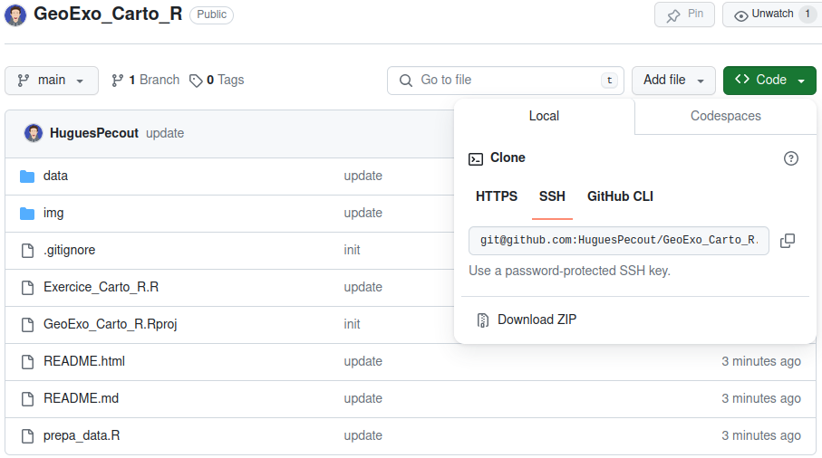

# Exercice - "Cartographie avec R" 

## Cartographie Sénégal

*Hugues Pecout*

### Télachargement de l’espace de travail

Téléchargez le projet *GeoExo_Carto_R** sur votre
machine puis le dézipper.   

Vous pouvez ensuite lancer le projet Rstudio en double-cliquant sur le fichier **GeoExo_Carto_R.Rproj** 

### Présentation des données à utiliser

Les fichier de données sont mis à disposition sont contenu dans le dossier **data**.
Ce repertoire contient 4 couches d’information géographiques :

- **LA_ARRONDISSEMENT_S.shp**, les limites des 122 arrondissements du Sénégal. Base de données géospatiales prioritaires du Sénégal à l’échelle 1 / 1 000 000. https://www.geosenegal.gouv.sn/, 2014.
- **LA_DEPARTEMENT_S.shp**, les limites des 42 départements du Sénégal. Base de données géospatiales prioritaires du Sénégal à l’échelle 1 / 1 000 000. https://www.geosenegal.gouv.sn/, 2014.
- **LA_REGION_S.shp**, les limites des 14 régions du Sénégal. Base de données géospatiales prioritaires du Sénégal à l’échelle 1 / 1 000 000. https://www.geosenegal.gouv.sn/, 2014.
- **LA_FRONTIERE_INTERNATIONALE_FRONTIERE_ETAT_L**, les frontières nationnales du Sénégal. Base de données géospatiales prioritaires du Sénégal à l’échelle 1 / 1 000 000. https://www.geosenegal.gouv.sn/, 2014.

Pour importer ces fichiers shapefiles, utilisez la fonction `st_read` du package `sf`

    library(sf)
    region <- st_read("data/LA_REGION_S.shp")
    
Le repertoire de données contient également un fichier de données contenant la population par région, de 2015 à 2024 (**Population_2015_2024.csv**). Ces données ont été téléchargé depuis le portail de données de l'agence nationale de la statisique et de la démographie.

    mystat <- read.csv("data/Population_2015_2024.csv")

### Cartes à réaliser

- Carte en symbols proportionnels
- Carte en Aplat de couleur
- Carte combinée

Pour réaliser ces cartes, utilisez la fonction `mf_map` du package `mapsf`

    library(mapsf)
    mf_map(x = my_data, var = ..., ...)

