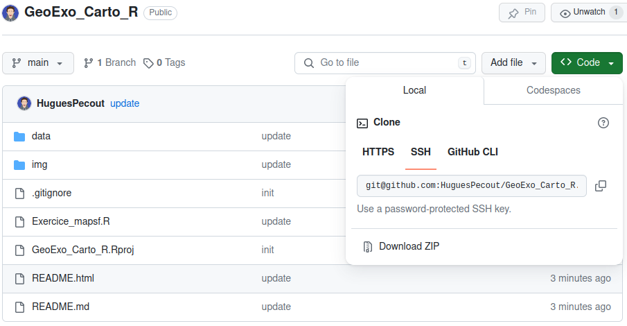
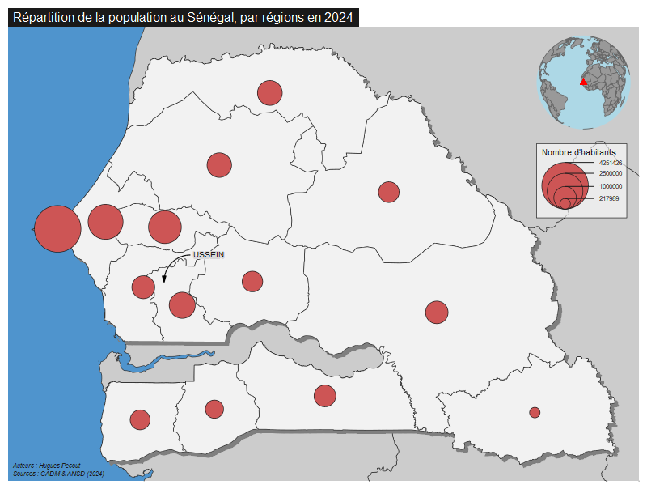
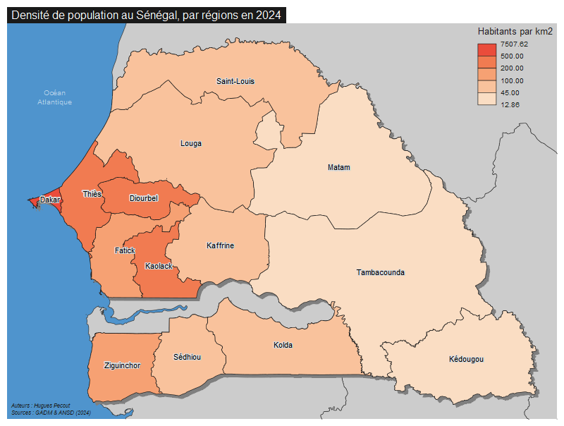

# Cartographie avec R - Exercice appliqué 

### Master Géomatique - Université du Sine Saloum El-Hâdj Ibrahima NIASS

*Hugues Pecout*

 

#### **A. Téléchargement de l’espace de travail**

Un projet Rstudio est téléchargeable à ce lien : [**https://github.com/HuguesPecout/GeoExo_Carto_R**](https://github.com/HuguesPecout/GeoExo_Carto_R)

Téléchargez le dépot zipper ("*Download ZIP*") **GeoExo_Carto_R** sur votre machine.   

 

Une fois le dossier dézipper, lancez le projet Rstudio en double-cliquant sur le fichier **GeoExo_Carto_R.Rproj**.

 

#### **B. Les données à disposition**

Les fichier de données sont mis à disposition dans le répertoire **data**, qui contient deux fichiers de données.

- **Un fichier GeoPackage** (**GeoSenegal.gpkg**) qui contient 6 couches géographiques :

    - **Pays_voisins** : Couche des frontières du Sénégal et de l'ensemble de ses pays limitrophes. Source : https://gadm.org/, 2014   
    - **Senegal** : Couche des frontières du Sénégal. Source : https://gadm.org/, 2014   
    - **Regions** : Couche des régions sénégalaises. Source : https://gadm.org/, 2014   
    - **Departements** : Couche des Departements sénégalais. Source : https://gadm.org/, 2014   
    - **Localites** : Couche de points des localités sénagalaises. Source : Base de données géospatiales prioritaires du Sénégal. https://www.geosenegal.gouv.sn/, 2014.   

 

- **Un fichier CSV** (**Population_2015_2024.csv**) qui contient des données sur la population des différentes régions sénégalaises de 2015 à 2014.

Ces données ont été téléchargées depuis le portail de données de l'Agence Nationale de la Statisique et de la Démographie (ANSD, https://senegal.opendataforafrica.org/data/, 2014)

 

#### **C. Import des données**

Utilisez le package `sf` pour importer les couches géographiques du fichier **GeoSenegal.gpkg**. La fonction `st_layers()` peut vous permettre de consulter les différentes couches de données contenus dans un fichier GeoPackage.

    library(sf)
    st_layers("data/GeoSenegal.gpkg")
    

Utilisez ensuite la fonction `st_read()`  du package `sf` pour importer les différentes couches.

    reg <- st_read(dsn = "data/GeoSenegal.gpkg", layer = "Regions")
    
 

Pour importer le fichier de données sur la population par régions, utilisez la fonction `read.csv()`
    

    pop <- read.csv("data/Population_2015_2024.csv")

 

## **EXERCICE**

#### **En vous appuyant sur le manuel [Cartographie avec R](https://rcarto.github.io/cartographie_avec_r/), réalisez les 3 cartes thématiques suivantes.**

##### 1. Une carte en symboles proportionnels représentant le nombre d'habitants par région en 2024. 

Exemple :

 

##### 2. Une carte choroplèthe représentant la densité de population par km2, par région en 2024. 

Exemple :

Pour calculer la surface du polygone, utilisez la fonction `st_area()` du package `sf` 

    reg$surface <- st_area(x = reg) 
    
    
Pour convertir l'unité de mesure de la surface calculée, utilisez la fonction  `set_units()` du package `units`
    
    library(units)
    reg$surface <- set_units(reg$surface, km^2)

 

##### 3. Une carte de sotck et de ratio représentant les nombre d'habitants par région en 2024 (symbole proportionnel) et le taux d'évolution de la population (en %) entre 2015 et 2024 (en aplat de couleur dans les symboles proportionnels). 

Exemple :

 

$Taux\ d'évolution\ de\ la\ population\ entre\ 2015\ et\ 2014=\dfrac{Pop2024-Pop2015}{Pop2015}$

